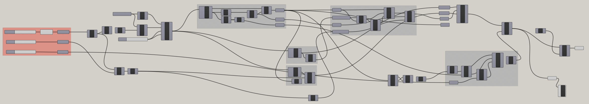

# fillet.gh

With this script one can create a G2 fillet which has an arc inbetween.

## Parameters

- Blend Angle
- Total Angle
- Arc Radius

## How it works

This script first creates a curve blend between 2x blend angle. Then, it splits the blending curve in half and connects them with an arc.